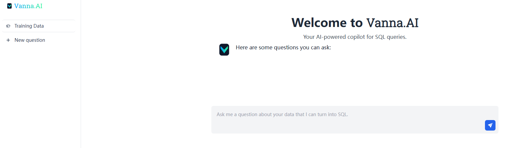
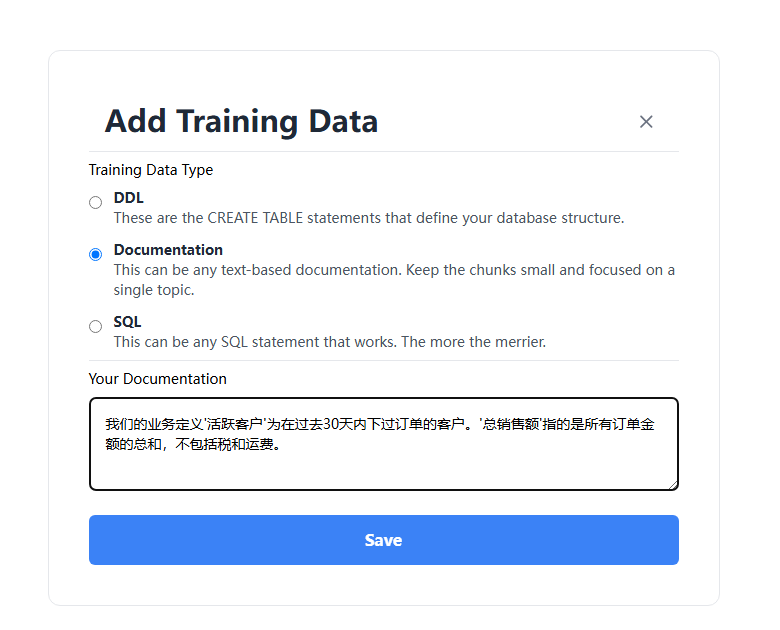
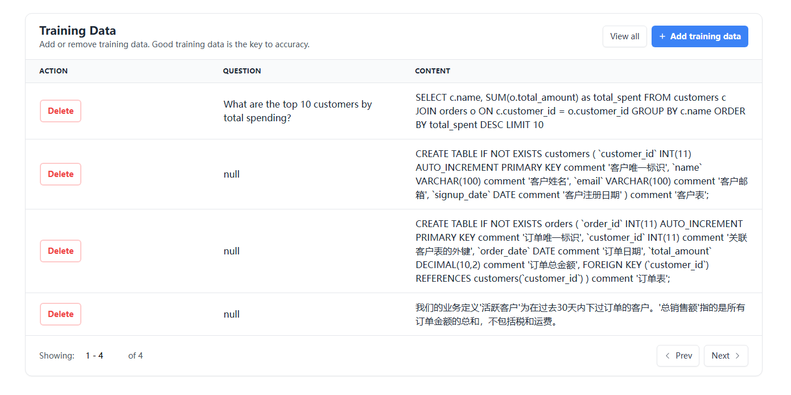
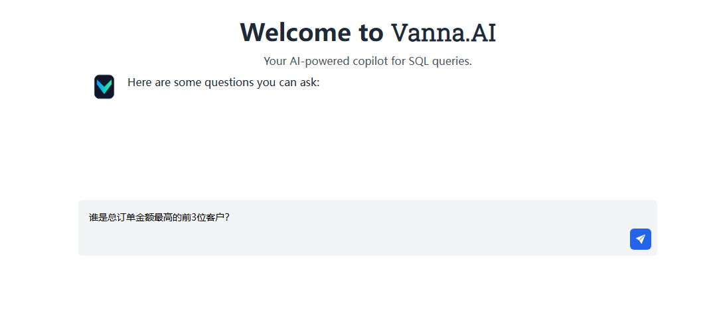
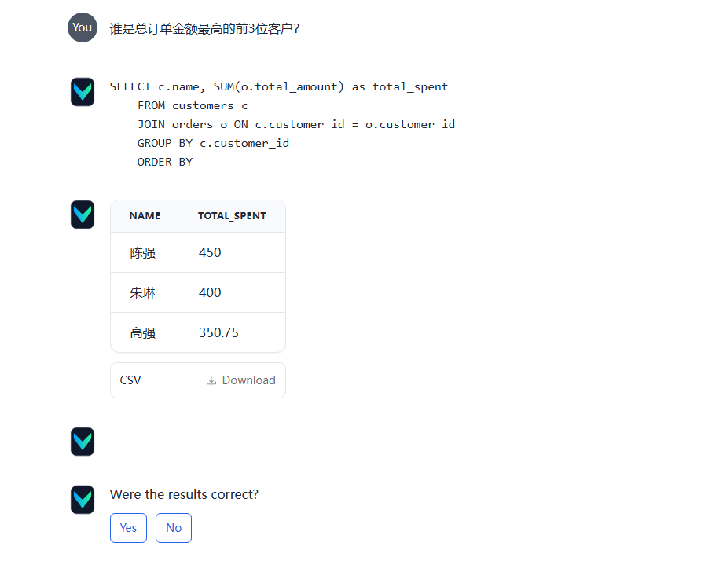

#### 部署服务

**配置环境变量**

在项目目录下修改 `.env` 文件

```shell
# LLM模型配置
OPENAI_LLM_MODEL=
OPENAI_LLM_API_KEY=
OPENAI_LLM_BASE_URL=

# Embedding模型配置
OPENAI_EMBEDDING_MODEL=
OPENAI_EMBEDDING_API_KEY=
OPENAI_EMBEDDING_BASE_URL=

# 向量数据库配置
MILVUS_URI=
MILVUS_USER=
MILVUS_PASSWORD=

# 关系型数据库配置
MYSQL_HOST=
MYSQL_PORT=
MYSQL_DBNAME=
MYSQL_USER=
MYSQL_PASSWORD=
```

**启动服务**

```shell
python app.py
```

**访问服务**

```shell
http://服务器IP:8080
```



**mysql中预置数据**

```sql
# 登录mysql容器
docker exec -it mysql-standalone /bin/bash
# 连接mysql服务端
mysql -u root -p 123456
#执行以下SQL
use vanna;
CREATE TABLE IF NOT EXISTS customers (
    `customer_id` INT(11) AUTO_INCREMENT PRIMARY KEY comment '客户唯一标识',
    `name` VARCHAR(100) comment '客户姓名',
    `email` VARCHAR(100) comment '客户邮箱',
    `signup_date` DATE comment '客户注册日期'
) comment '客户表';

CREATE TABLE IF NOT EXISTS orders (
    `order_id` INT(11) AUTO_INCREMENT PRIMARY KEY comment '订单唯一标识',
    `customer_id` INT(11) comment '关联客户表的外键',
    `order_date` DATE comment '订单日期',
    `total_amount` DECIMAL(10,2) comment '订单总金额',
    FOREIGN KEY (`customer_id`) REFERENCES customers(`customer_id`)
) comment '订单表';

INSERT INTO customers (name, email, signup_date) VALUES
('张三', 'zhangsan_2024@gmail.com', '2024-02-18'),
('李四', 'lisi123@qq.com', '2024-05-03'),
('王芳', 'wangfang_05@163.com', '2024-08-22'),
('陈强', 'chenqiang_22@hotmail.com', '2024-11-11'),
('刘洋', 'liuyang_19@gmail.com', '2025-01-07'),
('周敏', 'zhoumin_08@qq.com', '2025-03-15'),
('吴浩', 'wuhaoo@163.com', '2025-04-28'),
('郑婷', 'zhengting_12@gmail.com', '2025-06-10'),
('孙明', 'sunming_30@hotmail.com', '2024-07-04'),
('杨雪', 'yangxue_03@qq.com', '2024-09-19'),
('赵磊', 'zhaolei_15@163.com', '2025-02-25'),
('黄晓', 'huangxiao_28@gmail.com', '2025-05-14'),
('林娜', 'linna_07@qq.com', '2024-01-09'),
('徐亮', 'xuliang_11@hotmail.com', '2024-04-12'),
('朱琳', 'zhulin_20@163.com', '2025-07-01'),
('马超', 'machao_09@gmail.com', '2024-06-20'),
('胡静', 'hujing_14@qq.com', '2025-01-18'),
('郭伟', 'guowei_23@hotmail.com', '2024-03-30'),
('何雨', 'heyu_06@163.com', '2025-04-05'),
('高强', 'gaoqiang_17@gmail.com', '2024-10-27');

INSERT INTO orders (customer_id, order_date, total_amount) VALUES
(1, '2024-02-20', 159.99),
(2, '2024-05-10', 89.50),
(3, '2024-08-25', 299.00),
(4, '2024-11-15', 450.00),
(5, '2025-01-12', 120.75),
(6, '2025-03-20', 75.20),
(7, '2025-04-30', 199.90),
(8, '2025-06-15', 300.50),
(9, '2025-07-05', 99.99),
(10, '2024-09-25', 180.00),
(11, '2025-02-28', 145.60),
(12, '2025-05-20', 220.30),
(13, '2024-01-15', 55.00),
(14, '2024-04-20', 175.80),
(15, '2025-07-10', 400.00),
(16, '2024-06-25', 110.00),
(17, '2025-01-25', 90.50),
(18, '2024-04-05', 130.20),
(19, '2025-04-15', 250.00),
(20, '2024-10-30', 350.75);
```

**Vanna中训练数据**

点击 `Training Data` -> `Add training data`，选择`DDL`，分2次输入

```sql
CREATE TABLE IF NOT EXISTS customers (
    `customer_id` INT(11) AUTO_INCREMENT PRIMARY KEY comment '客户唯一标识',
    `name` VARCHAR(100) comment '客户姓名',
    `email` VARCHAR(100) comment '客户邮箱',
    `signup_date` DATE comment '客户注册日期'
) comment '客户表';
CREATE TABLE IF NOT EXISTS orders (
    `order_id` INT(11) AUTO_INCREMENT PRIMARY KEY comment '订单唯一标识',
    `customer_id` INT(11) comment '关联客户表的外键',
    `order_date` DATE comment '订单日期',
    `total_amount` DECIMAL(10,2) comment '订单总金额',
    FOREIGN KEY (`customer_id`) REFERENCES customers(`customer_id`)
) comment '订单表';
```

再选择Documentation，输入

```sql
我们的业务定义'活跃客户'为在过去30天内下过订单的客户。'总销售额'指的是所有订单金额的总和，不包括税和运费。
```




再选择SQL，输入

```sql
SELECT c.name, SUM(o.total_amount) as total_spent
FROM customers c
JOIN orders o ON c.customer_id = o.customer_id
GROUP BY c.name
ORDER BY total_spent DESC
LIMIT 10
```

训练了4条数据



测试效果，点击`New question`，输入`谁是总订单金额最高的前3位客户？`



得到如下结果



结果符合预期，测试完成
